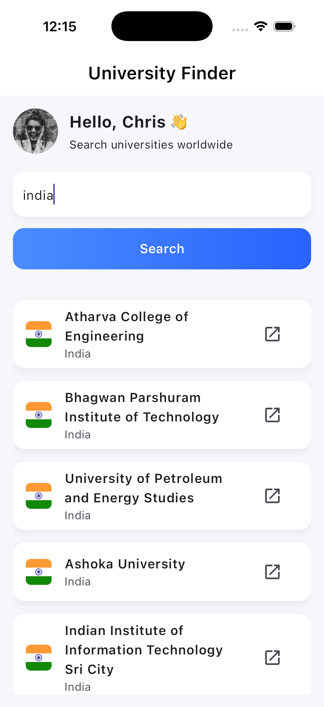
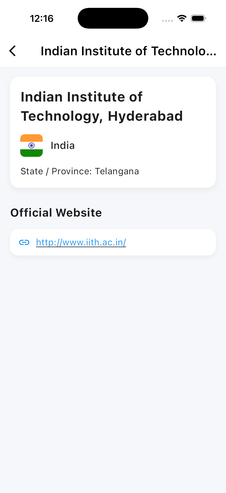
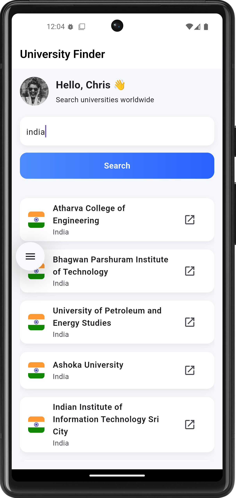
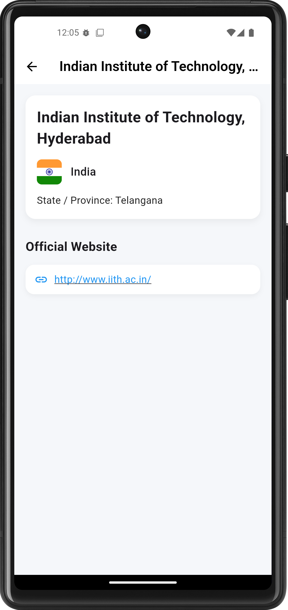

## Overview

Global University Search App is an education Flutter Application that enables users to search for their universities across the world quickly. Users are required to enter a country name, the app fetches results from Hipolabs Universities API (official GitHub: https://github.com/Hipo/university-domains-list
), the user can then view details including the university name, website

This project has been built with clean architecture principles and Flutter best practices. The app uses MVVM pattern, Riverpod for state management and GoRouter for routing. The architecture ensures maintainability, scalability, separation of concerns, and testability

The app focuses smooth and polished experience:

- Clean UI following Material 3
- Country flag rendering via ISO code mapping
- Input validation and live error feedback
- Seamless navigation between screens
- Graceful handling of empty results and network issues
- Clear architecture separation: Models, Views, ViewModels, Services

Additionally, the project includes IOS specific security configuration to safely allow access to the API endpoint, which serves data via HTTP instead of HTTPS, which is handled through an App Transport Security (ATS) exception restricted to the required domain only. Android also blocks http requests, hence the app includes a secure, domain-restricted network configuration that allows cleartext traffic only for universities.hipolabs.com, keeping all other HTTP domains blocked.

## Key Features

### Home Screen

✅ Hardcoded mock profile (name + avatar)

✅ Country input field

✅ Search button with gradient UI

✅ Displays loading, success and error states

✅ Responsive list of universities

✅ Country flag rendering through utility mapping

✅ Tap to view details

✅ Quick-launch website icon

### Detail Screen

✅ Name of the University

✅ Country and national flag

✅ Optional state / province field (If the API service provides)

✅ Launch website externally via `url_launcher`

✅ Clean card style layout

### Architecture & Development

✅ **MVVM** clean architecture

✅ **Riverpod** state management

✅ **GoRouter** navigation

✅ **Dio** for networking

✅ Utility file for ISO country code conversion

✅ Comprehensive error handling

✅ iOS ATS configuration for insecure API

✅ Clean folder structure

---
### IOS Screenshots
<table align="center">
<tr>
<td align="center"><br>Home Screen</td>
<td align="center"><br>Search Results</td>
<td align="center"><br>Detail Screen</td>
</tr>
</table>


---

### Android Screenshots
<table align="center">
<tr>
<td align="center"><br>Home Screen</td>
<td align="center"><br>Search Results</td>
<td align="center"><br>Detail Screen</td>
</tr>
</table>

---

### 🎞️ APP Walkthrough
<table align="center">
<td align="center">
  <br>
  <sub><i>(GIF may take a moment to load)</i></sub>
</td>
</table>


---

## How to Run the App

### **1. Clone the repository**

```bash
git clone https://github.com/Hipo/university-domains-list-api.git

```

### **2. Install all the dependencies**

```bash
flutter pub get

```

### **3. Run the app ( to run on default device )**

```bash
flutter run

```

### Optional:

To run on a specific device only:

```bash
flutter run -d <device_id>

```

---

## Tech Stack & Tools

### **Framework & UI**

- Flutter (Material Design 3)

### **Architecture**

- **MVVM (Model – View – ViewModel)**
    
    ### **Models: Data Structure / API Representation**
    
    - Located in: `lib/models/`
    - To define the structure of the data that is being received from the API (`University` model).
    - Responsible only for **holding data** and **JSON serialization / deserialization**.
    - Doesn’t contain UI logic, it only ensures pure data objects.
    
    ### **ViewModels: Business Logic + State Management (Riverpod)**
    
    - Located in: `lib/viewmodels/`
    - Built using **Riverpod’s StateNotifier**, provides immutable state and predictable updates
    - Handles:
        - Input validation
        - Loading states
        - Error states
        - API calls via the Service layer
        - Exposes clean data to the UI (View layer)
    - Keeps the UI “dumb” and reactive, the View simply listens to the ViewModel and rebuilds the screens.
    
    ### **Views: The Presentation Layer (Screens/UI Widgets)**
    
    - Located in: `lib/views/`
    - It contains only the UI part of the code (HomeScreen and DetailScreen).
    - Networking or Business logic is not handled inside the views.
    - Subscribes to the ViewModel's state using Riverpod providers.
    - Wha does it display in this project:
        - Text fields
        - Buttons
        - Loading indicators
        - Error UI
        - List of universities
        - Detail information
    - It interacts with the ViewModel through properly defined methods ( e.g., `searchUniversity()`).
    
    ### **Services: API Communication Layer**
    
    - Located in: `lib/services/`
    - **UI or state logic** is not handle under services
    - It is responsible for interacting with external APIs using **Dio**:
        - Sending requests
        - Parsing responses
        - Returning model objects
    - Follows a clean separation ( ViewModels never directly talk to HTTP clients )
    
    ### **Utils: Helper Utilities & Shared Logic**
    
    - Located in: `lib/utils/`
    - Responsible for handling small but important app-wide logic:
        - Country name → ISO code conversion (for flags)
    - Hence, it ensures reusability and avoids duplication.
    - 

### **State Management**

- **Riverpod (`flutter_riverpod`)**
    
    Used as the primary state management solution due to its declarative, safe, and test-friendly design.
    
    Riverpod provides:
    
    - Immutable state updates through `StateNotifier`
    - Automatic UI rebuilds on state change
    - Compile-time safety (no runtime Provider errors)
    - Clear separation between UI and business logic
    - Easy scalability as the app grows
    
    In this project, Riverpod powers the **UniversityViewModel**, managing loading states, error states, API data, and user interactions.
    

### **Routing**

- **GoRouter**
    
    The app uses GoRouter for clean and maintainable navigation.
    
    GoRouter provides:
    
    - A declarative route structure
    - Type-safe navigation
    - Built-in support for nested routes and deep linking
    - Easy parameter passing using `state.extra`
    - Cleaner API compared to Navigator 1.0
    
    Implemented routes:
    
    - `/` → **HomeScreen**
        
        Displays the profile, search input, loading/error states, and results list.
        
    - `/details` → **DetailScreen**
        
        Shows full university information; receives a `University` model through navigation extras.
        
    
    This architecture keeps navigation logic out of the UI and ensures the app remains maintainable.
    

### **Networking**

- **Dio** (HTTP client)
    
    Dio is used for API communication because it is more robust and configurable than the default `http` package.
    
    Key advantages:
    
    - Rich error handling via `DioException`
    - Request/response interceptors (if needed later)
    - Automatic JSON parsing
    - Timeout support
    - Cleaner syntax and better debugging tools
    
    All network operations are isolated within the **Service Layer**, ensuring the ViewModel and UI remain clean and testable.
    

### **External Links**

- **`url_launcher`**
    
    Used for launching university websites securely in the user’s default browser.
    
    Ensures:
    
    - Safe validation with `canLaunchUrl`
    - External browser launch via `LaunchMode.externalApplication`
    - No reliance on WebView or in-app browsing
    - Graceful fallback if a URL cannot open
    
    This keeps the user experience seamless and avoids crashes from invalid URLs.
    

### **Country Flags**

- **`country_flags` package**
    
    Handles nation flags using ISO country codes, ensuring:
    
    - Accurate flag rendering
    - Zero manual assets
    - High performance and simplicity
- **Custom `getCountryCode()` Utility**
    
    Since the API returns full country names instead of ISO codes, a custom mapping utility converts names to 2-letter codes.
    
    Features:
    
    - Covers a wide list of countries
    - Ensures accurate flag display
    - Includes a safe fallback (`"US"`) to prevent crashes
    - Prevents reliance on external lookup APIs
    
    This utility makes flag rendering consistent and fully offline-capable.
    

## Folder Structure (Clean Architecture)

```
lib/
│
├── main.dart                     # App entry point (MaterialApp.router)
│
├── routes/
│   └── app_router.dart           # GoRouter configuration
│
├── models/
│   └── university.dart           # University data model
│
├── services/
│   └── university_service.dart   # API service with Dio
│
├── utils/
│   └── country_codes.dart        # ISO country code mapping for flags
│
├── viewmodels/
│   └── university_viewmodel.dart # Riverpod + MVVM logic
│
└── views/
    ├── home_screen.dart          # Search UI, list of universities
    └── detail_screen.dart        # University detail view

```

## Security Considerations

### 1. HTTPS vs HTTP

The Hipolabs Universities API provides data over **HTTP only**, not HTTPS.

Since iOS blocks HTTP requests by default due to **App Transport Security (ATS)**, the app includes a **restricted ATS exception ONLY for the required domain**:

```xml
<!-- Allow HTTP only to universities.hipolabs.com -->
<key>NSAppTransportSecurity</key>
<dict>
    <key>NSExceptionDomains</key>
    <dict>
        <key>universities.hipolabs.com</key>
        <dict>
            <key>NSExceptionAllowsInsecureHTTPLoads</key>
            <true/>
            <key>NSIncludesSubdomains</key>
            <true/>
        </dict>
    </dict>
</dict>

```
Android (API 28 and above) also blocks all HTTP requests by default. Since the Hipolabs API is served over **HTTP**, the app includes a secure, domain-restricted network configuration that allows cleartext traffic **only for `universities.hipolabs.com`**, keeping all other HTTP domains blocked.

### AndroidManifest.xml

`android/app/src/main/AndroidManifest.xml`

```xml
<applicationandroid:name="${applicationName}"
    android:label="university_search_app"
    android:icon="@mipmap/ic_launcher"
    android:usesCleartextTraffic="true"
    android:networkSecurityConfig="@xml/network_security_config">

```

### Network Security Config

`android/app/src/main/res/xml/network_security_config.xml`

```xml
<?xml version="1.0" encoding="utf-8"?>
<network-security-config>
    <domain-config cleartextTrafficPermitted="true">
        <domain>universities.hipolabs.com</domain>
    </domain-config>
</network-security-config>

```

###


**Security Benefits:**

- Only *one domain* is allowed (least privilege principle)
- All other network calls remain secure
- No wildcard or global insecure access

### 2. Safe Error Handling

- Network errors → Snackbars with user-friendly messages
- No results → Clear on-screen error
- Invalid input → Direct validation message
- Dio exceptions converted to readable messages
- Safe null-checks for state/province
- Website links validated using `canLaunchUrl`

### 3. Data Safety

- Only public API used
- No sensitive user data collected
- No local storage used
- No credentials or keys exposed

---

## Error Handling Overview

The app handles errors through:

- **ViewModel-level try/catch**
- **Graceful state updates** (loading → error → retry)
- **Inline UI messages**
- **Snackbars** for transient errors
- Retry button (except for validation failures)
- Validation for empty input
- Handling `state.error` separately from loading and results

This ensures predictable, user-friendly error flow at all times.


## Screenshots

<table align="center"> <tr> <td align="center">  <br><b>Empty Country Input Error</b> </td> <td align="center">  <br><b>No Results Found Error</b> </td> <td align="center">  <br><b>Network Failure Error</b> </td> </tr> </table>